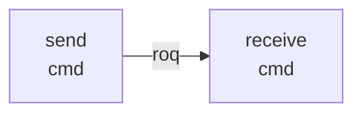
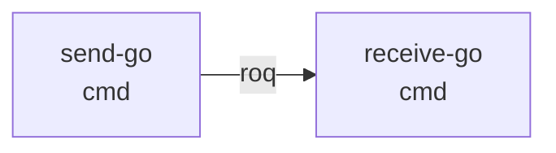
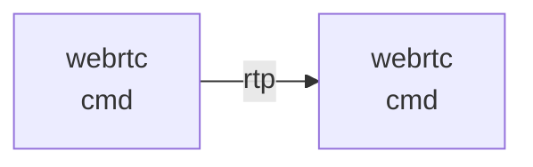
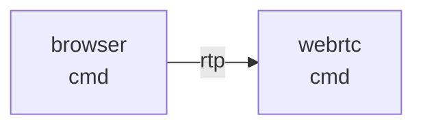

# MRTP

## Overview
MRTP consists of several subcommands that support different transport protocols.

### RTP over QUIC (RoQ)
The `send` and `receive` subcommands can send and receive video streams and data.
They support RoQ and plain RTP over UDP.

If RoQ is activated, the video stream is sent using RTP over QUIC, according to the [RoQ Internet-Draft](https://datatracker.ietf.org/doc/draft-ietf-avtcore-rtp-over-quic/14/) and data is sent over a reliable data channel based on the [QUIC Data Channels  Internet-Draft](https://datatracker.ietf.org/doc/draft-engelbart-quic-data-channels/00/).

Without RoQ, it sends the RTP packets over UDP without any signaling.

GStreamer is used for handling the video stream.



#### _**Experimental:**_ RoQ without GStreamer 
The `send-go` and `receive-go` subcommand use a custom video pipeline instead of GStreamer.




### WebRTC
Uses [Pion WebRTC](https://github.com/pion/webrtc/) to send a video stream using RTP and data using WebRTC data channels.
One of the peers must act as the offerer.


### Chrome
The `browser` command can send a video stream and data using Chrome’s WebRTC library.
As the congestion controller, Chrome uses its own GCC implementation.




## Setup
### Setup SCReAM Gstreamer plugin

* Clone with submodules
* In root directory, set `GST_PLUGIN_PATH=./scream/gstscream/target/debug/` and `LD_LIBRARY_PATH=./scream/code/wrapper_lib/`

### Setup gopipe
Only required for the experimental `send-go` and `receive-go` commands.
#### h264
Installation encoder:
* Mac: brew install x264
* Ubuntu: apt install libx264-dev

Installation decoder:
* install libav


#### vpx
Installation:
* Mac: brew install libvpx
* Ubuntu: apt install libvpx-dev

## Usage
### RTP over QUIC (RoQ)

Start the receiver:
```
go run cmd/main.go receive -roq-server -roq-mapping 1
```
Start the sender:
```
go run cmd/main.go send -roq-client -roq-mapping 1 -bwe gcc
```
Add `-source-location <path/to/video>` to send a custom video instead of videotestsrc.

### WebRTC
Start the receiver:
```
go run cmd/main.go webrtc -local-port 8081 -remote-port 8080 -pion-ccfb
```
Start the sender:
```
go run cmd/main.go webrtc -local-port 8080 -remote-port 8081 -pacing -bwe gcc -send-track - offer -pion-read-ccfb
```
Add `-source-location <path/to/video>` to send a custom video instead of videotestsrc.

### Chrome
Start the `webrtc` command as receiver:
```
go run cmd/main.go webrtc -local-port 8081 -remote-port 8080 -sink-codec VP8 -pion-twcc
```
Start Chrome:
```
go run cmd/main.go browser -source-location <path/to/video> -local-port 8080 -remote-port 8081
```

## Congestion Control Combinations
|                | NADA     | GCC  | SCReAMv1 | SCReAMv2 | SCReAMv2 L4S | UDP Prague (L4S) |
| -------------- | -------- | -------- | -------- | -------- | ------------ | ---------------- |
| WebRTC         | ✅       | ✅       | ❌[^1]   | ❌[^1]   |              |                  |
| QUIC (RoQ) | ✅       | ✅       | ❌[^2]   | ❌[^2]   | ❌[^2]       |                  |
| UDP (Gst)      |          |          | ✅       | ?[^3]    |              |                  |


[^1]: There are two ways to implement this: Using the SCReAM Gstreamer plugin or using SCReAM directly from Pion interceptors. SCReAMs RFC8888 feedback is currently not compatible with Pion. One issue is https://github.com/EricssonResearch/scream/pull/66. Another one is some SSRC rewriting going on in SCReAM or Pion, which makes it impossible to pass feedback correctly. Should be possible to fix, but no idea when.
[^2]: SCReAM will not work over RTP over QUIC because it is implemented with RTP in mind and requires access to packet queues from which it might try to drop packets. QUIC does not like dropping queued stuff (and does not even queue data in packets, packets are only created from queued *stuff* when it is send).
[^3]: *Should* work, but behaves weird, possibly misconfigured parameters.